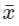
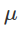

# Data and Sampling Distributions
Modern statistics have moved away from assumptions about a population, in
favor of sampling where the assumptions about the underlying distribution
are not necessary.

Data scientists should focus on the sampling procedures and the data right in
front of us, but sometimes you can gain additional insight from knowledge about
the population.

## Random Sampling and Sample bias

**Key Terms: Random Sampling**

**Sample** - a subset of the **population**, which is a larger dataset that is
large and defined, but sometimes imaginary or theoretical.

**N (n)** - the size of the population. Little (n) is used for the sample size

**Random Sampling** - drawing elements into a sample at random

**Stratified Sampling** - dividing the population into _strata_ and randomly
sampling from each strata

**Stratum (pl strata)** - a homogeneous subgroup of a population with common
characteristics.

**Simple Random Sample** - the sample that results from random sampling without
stratifying the population.

**Bias** - systematic error

**Sample Bias** - a sample that misrepresents the population

 _Random Sampling_ a process in which every member of the population being
 sampled has an equal opportunity of being chosen for the sample at each draw

 The sample that results is called a simple random sample.
 - _with replacement_: observations are put back into population so they are
 available for re-selection
 - _without replacement_ observations are no longer available after being
 chosen for sample

It seems that in making an estimate or a model based on sample, having data
that's representative and clean is more important than quantity

When collecting data, and also when choosing pre-collected data, you need to
guard against sample bias, in which your sample is different in some meaningful
non-random way than the population it what mean to represent.

Samples are rarely perfect representations of the population, but if there's
some non-random bias in the way the data is being collected, you can expect
other sample to reflect the same difference when collected the same way.

_Self Selection Bias_: This refers to the way yelp reviews can often be written
largely by people driven to write a review because they've had a bad experience.
Sometimes self selection samples can be reliable in comparing similar establishments

### Bias
_Bias_ refers to measurement or sampling errors that are systematic and produced
by the measurement or sampling process

### Random Selection
_Random sampling_ is a method of achieving "representativeness" in a sample.
Truly random sampling may not always be easy.

In _stratified sampling_, the population is divided into strata and random
samples are taken from each strata. **Example**: In a political poll, divide
certain racial groups into strata but overweight groups that might
be underrepresented.

### Size versus Quality: When Does Size Matter?
Sometimes smaller can be better, it's often more feasible to track down missing
values or evaluate outliers in large datasets. Consider google searches; This
example of big data is sparse. The vector representation of a search for
"Data Science" is mostly zeros. When you accumulate lots of this kind of data,
you can achieve very specific search results.

### Sample Mean versus Population Mean

 -  -> Mean of a Sample
 -  -> Mean of Population

 We keep these separate because a sample mean is observed but a population mean is often inferred from sample.

**Key Ideas**
- Even with big data, random sampling is still important for data scientists
- Bias happes when observations are systematically erroneous because they don't
represent the entire population
- When it comes to data, quality is often more important than quantity and data
scientists can realistically improve on quality and bias in a way that would be
more expensive (in many ways) with a larger data set

## Selection Bias
Selection bias happens when you selectively choose data, whether you know it or
not, in a way that leads to a misleading conclusion.

**Key Terms**
- **Selection bias**: Bias resulting from how you select observations
- **Data snooping**: Digging through data in search of something interesting
- **Vast search effect**: Bias or nonreproducibility resulting form repeated data
modeling, or modeling data with large numbers of predictor variables.

"If you torture the data long enough, sooner or later it will confess." This can
be a product of _data snooping_. There is a difference between things that are
verified via the testing of a hypothesis through an experiment vs a phenomenon
that gets discovered by snooping through the data.

This is inevitably going to be something you run into as a data scientist because
you're looking at large data sets. If you repeatedly run different models and
ask different questions with a large dataset, you're going to find something interesting.

Always ask yourself: "Is it really some"

### Regression to the Mean

## Sampling Distribution of a Statistic

### Central Limit Theorem

### Standard Error

## The Bootstrap

### Resampling versus Bootstrapping

## Confidence Intervals

## Normal Distribution

### Standard Normal and QQ-Plots

## Long-Tailed Distribution

## Student's t-Distribution

## Binomial Distribution

## Chi-Square Distribution

## F Distribution

## Poisson and Related Distributions

### Poisson Distributions

### Exponential Distribution

### Estimating the Failure Rate

### Weibull Distribution

## Summary
