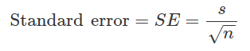

# Data and Sampling Distributions
Modern statistics have moved away from assumptions about a population, in
favor of sampling where the assumptions about the underlying distribution
are not necessary.

Data scientists should focus on the sampling procedures and the data right in
front of us, but sometimes you can gain additional insight from knowledge about
the population.

## Random Sampling and Sample bias

**Key Terms: Random Sampling**

**Sample** - a subset of the **population**, which is a larger dataset that is
large and defined, but sometimes imaginary or theoretical.

**N (n)** - the size of the population. Little (n) is used for the sample size

**Random Sampling** - drawing elements into a sample at random

**Stratified Sampling** - dividing the population into _strata_ and randomly
sampling from each strata

**Stratum (pl strata)** - a homogeneous subgroup of a population with common
characteristics.

**Simple Random Sample** - the sample that results from random sampling without
stratifying the population.

**Bias** - systematic error

**Sample Bias** - a sample that misrepresents the population

 _Random Sampling_ a process in which every member of the population being
 sampled has an equal opportunity of being chosen for the sample at each draw

 The sample that results is called a simple random sample.
 - _with replacement_: observations are put back into population so they are
 available for re-selection
 - _without replacement_ observations are no longer available after being
 chosen for sample

It seems that in making an estimate or a model based on sample, having data
that's representative and clean is more important than quantity

When collecting data, and also when choosing pre-collected data, you need to
guard against sample bias, in which your sample is different in some meaningful
non-random way than the population it what mean to represent.

Samples are rarely perfect representations of the population, but if there's
some non-random bias in the way the data is being collected, you can expect
other sample to reflect the same difference when collected the same way.

_Self Selection Bias_: This refers to the way yelp reviews can often be written
largely by people driven to write a review because they've had a bad experience.
Sometimes self selection samples can be reliable in comparing similar establishments


### Bias
_Bias_ refers to measurement or sampling errors that are systematic and produced
by the measurement or sampling process

### Random Selection
_Random sampling_ is a method of achieving "representativeness" in a sample.
Truly random sampling may not always be easy.

In _stratified sampling_, the population is divided into strata and random
samples are taken from each strata. **Example**: In a political poll, divide
certain racial groups into strata but overweight groups that might
be underrepresented.

### Size versus Quality: When Does Size Matter?
Sometimes smaller can be better, it's often more feasible to track down missing
values or evaluate outliers in large datasets. Consider google searches; This
example of big data is sparse. The vector representation of a search for
"Data Science" is mostly zeros. When you accumulate lots of this kind of data,
you can achieve very specific search results.

### Sample Mean versus Population Mean

 -  -> Mean of a Sample
 -  -> Mean of Population

 We keep these separate because a sample mean is observed but a population mean is often inferred from sample.

**Key Ideas**
- Even with big data, random sampling is still important for data scientists
- Bias happes when observations are systematically erroneous because they don't
represent the entire population
- When it comes to data, quality is often more important than quantity and data
scientists can realistically improve on quality and bias in a way that would be
more expensive (in many ways) with a larger data set

## Selection Bias
Selection bias happens when you selectively choose data, whether you know it or
not, in a way that leads to a misleading conclusion.

**Key Terms**
- **Selection bias**: Bias resulting from how you select observations
- **Data snooping**: Digging through data in search of something interesting
- **Vast search effect**: Bias or nonreproducibility resulting form repeated data
modeling, or modeling data with large numbers of predictor variables.

"If you torture the data long enough, sooner or later it will confess." This can
be a product of _data snooping_. There is a difference between things that are
verified via the testing of a hypothesis through an experiment vs a phenomenon
that gets discovered by snooping through the data.

This is inevitably going to be something you run into as a data scientist because
you're looking at large data sets. If you repeatedly run different models and
ask different questions with a large dataset, you're going to find something interesting.

Always ask yourself: "Is it really something interesting or is it an outlier?"

You can use these techniques to bolster the confidence of your findings:
- holdout sets (sometimes more than one)
- target shuffling (basically a permutation test)

Things to guard against:
- nonrandom sampling
- cherry-picking data
- selection of time intervals that accentuate a specific effect
- stopping an experiment when you've achieved interesting results

### Regression to the Mean
This is the "rookie of the year, sophomore slump" phenomenon, basically. The
rookie does well because of luck and skill, but not quite as well the next
year when the luck isn't there. The previous year's outstanding performance was
an outlier; the following year's performance _regresses to the mean_.

- first identified by Francis Galton in 1886
- the children of extremely tall men tend not to be as tall as their father
- **Warning**: don't confuse this with linear regression!

**Key Ideas**
- You can protect against bias by starting out with a hypothesis, then collecting
data in a way that follows randomization and random sampling principles
- Any other method of analysis can be subject to bias resulting from data collection
or the analytical process (this includes repeated running of models in data mining,
data snooping in research and after-the-fact selection of interesting events).

## Sampling Distribution of a Statistic
The sampling distribution is the distribution of many samples from a population.

**Key Terms**
- **Sample statistic**: a metric calculated for a sample of data drawn from a
larger population
- **Data distribution**: the frequency distribution of individual values in a
data set
- **Sampling distribution**: the frequency distribution of a sample statistic over
many samples or resamples
- **Central limit theorem**: the tendency of the sampling distribution to take on
a normal shape as sample size rises
- **Standard error**: The variability (standard deviation) of a sample statistic
over many samples (don't confuse with standard deviation by itself, that's the
variability of individual data values, look this up)

When you draw a sample, you either want to measure or model something. You should
try to be attentive to _sampling variability_. **Warning**: Don't confuse the
_data distribution_ with the _sampling distribution_.

- the distribution of the sample statistic is usually more normal looking than
that of the data itself
- typically, if a sample is bigger, the sample statistic distribution will be
more narrow

Some distribution charts in R and Python:
R:
```R
library(ggplot2)
# take a simple random sample
samp_data <- data.frame(income=sample(loans_income, 1000),
                        type='data_dist')
# take a sample of means of 5 values
samp_mean_05 <- data.frame(
  income = tapply(sample(loans_income, 1000*5),
                  rep(1:1000, rep(5, 1000)), FUN=mean),
  type = 'mean_of_5')
# take a sample of means of 20 values
samp_mean_20 <- data.frame(
  income = tapply(sample(loans_income, 1000*20),
                  rep(1:1000, rep(20, 1000)), FUN=mean),
  type = 'mean_of_20')
# bind the data.frames and convert type to a factor
income <- rbind(samp_data, samp_mean_05, samp_mean_20)
income$type = factor(income$type,
                     levels=c('data_dist', 'mean_of_5', 'mean_of_20'),
                     labels=c('Data', 'Mean of 5', 'Mean of 20'))
# plot the histograms
ggplot(income, aes(x=income)) +
  geom_histogram(bins=40) +
  facet_grid(type ~ .)
```
Python:
```python3
import pandas as pd
import seaborn as sns

sample_data = pd.DataFrame({
    'income': loans_income.sample(1000),
    'type': 'Data',
})
sample_mean_05 = pd.DataFrame({
    'income': [loans_income.sample(5).mean() for _ in range(1000)],
    'type': 'Mean of 5',
})
sample_mean_20 = pd.DataFrame({
    'income': [loans_income.sample(20).mean() for _ in range(1000)],
    'type': 'Mean of 20',
})
results = pd.concat([sample_data, sample_mean_05, sample_mean_20])

g = sns.FacetGrid(results, col='type', col_wrap=1, height=2, aspect=2)
g.map(plt.hist, 'income', range=[0, 200000], bins=40)
g.set_axis_labels('Income', 'Count')
g.set_titles('{col_name}')
```

### Central Limit Theorem
The central limit theorem basically says that the means from many samples
will tend towards a "bell" curve even if the population from which the samples
are acquired isn't distributed normally, as long as the sample is big enough
and the data is fairly normal. This is what allows us to be able to use
formulas for inference.

- underpins hypothesis tests and confidence intervals
- formal hypothesis testing doesn't have a huge role in data science
- you can always bootstrap

### Standard Error
- summarizes the variability in the sampling distribution for a statistic
- based on the standard deviation and the sample size
- SE is inversely proportional to the sample size
- the relationship between SE and SS in known as _square-root of n_ rule; if you
want to reduce the SE by 2, you need to increase the SS by 4
- don't confuse standard deviation with standard error, the former measures variability
of individual data points, the latter measures variability of a sample metric

How you might measure SE _Note: This is kind of wasteful_:
1. collect new samples from population
2. for each new sample, calculate a statistic (like the mean)
3. get the standard deviation of what you calculated in step 2, this is basically
your estimate of standard error

Remember that you can always use bootstrap resamples, it's the modern way to
estimate the standard error.



**Key Ideas**
- frequency distribution of a sample statistic tells you how the metric might
vary from sample to sample
- you can get a sampling distribution from a bootstrap or from methods that rely
on the central limit theorem
- standard error summarizes the variability of a sample statistic

## The Bootstrap

**Key Terms**
- **Boostrap sample**: A sample taken with replacement from an observed dataset.
- **Resampling**: The process of taking repeated samples from observed data, includes
bootstrap and permutation procedures.

Bootstrapping:
> "...effectively [creates] an infinite population in which the probability
of an element being drawn remains unchanged from draw to draw."

The bootstrap algorithm:
1. Take a sample from the data, record it, then replace it
2. Repeat _n_ times
3. Record the mean of the _n_ resampled values
4. Repeat steps 1-3 _R_ times
5. Use the _R_ results to:
  - calculate the standard deviation
  - produce a histogram or boxplot
  - find a confidence interval

Using the R `boot` package:
```R
library(boot)
stat_fun <- function(x, idx) median(x[idx])
boot_obj <- boot(loans_income, R=1000, statistic=stat_fun)
```
Output:
```R
Bootstrap Statistics :
    original   bias    std. error
t1*    62000 -70.5595    209.1515
```

Using `scikit-learn` in Python:
```python3
results = []
for nrepeat in range(1000):
    sample = resample(loans_income)
    results.append(sample.median())
results = pd.Series(results)
print('Bootstrap Statistics:')
print(f'original: {loans_income.median()}')
print(f'bias: {results.mean() - loans_income.median()}')
print(f'std. error: {results.std()}')
```

You can do multivariate bootstrapping. _Bagging_ (or "bootstrap
  aggregating") is running multiple decision trees on bootstrap
samples and then averaging the results.

### Resampling versus Bootstrapping

_Warning_: bootstrapping doesn't make up for a small sample, it
just shows us how more samples would behave when drawn from a population resembling the sample.

**Key Ideas**
- boostrapping helps you assess the variability of a sample statistic
- you can often apply bootstrap sampling without looking too deeply into mathematical approximations of sampling distributions
- also good estimation of sampling distributions where there may be no well developed approximations
- bagging outperforms single model approaches in predictive modeling

## Confidence Intervals
Confidence intervals are yet another way to understand the potential error in a sample estimate

**Key Terms**
- **Confidence level**: The percentage of confidence intervals constructed in the same way and from the same population, expected to contain the statistic of interesting
- **Interval Endpoints**: the upper and lower confidence bounds
- **Point estimate**: a single number presented as an estimate

It's better to present your estimates as a range, confidence intervals help you achieve this.

**One way to describe CI's**:
> the interval that encloses 90% (in this case) of the bootstrap
sampling distribution of a sample statistic...an x% confidence interval around a sample estimate should contain similar sample estimates x% of the time, on average...

**Algorithm for a bootstrapped CI**:
1. Draw a random sample of size _n_ with replacement from the data
2. Record the statistic of interest for the resample
3. Repeat steps 1 & 2 (R) times
4. For an x% CI, trim [(100-x)/2]% of the (R) resample results from each end of the distribution
5. The trim points are the endpoints of a x% boostrap CI

_Note_: A bootstrap CI is not really telling you the probability that a
sample statistic lies within a certain value, although it gets interpreted that way

As a data scientist, you aren't going after writing a paper or comparable goals;
instead, you're using it to learn about the potential error in an estimate, and to
get a better idea of whether a larger sample is needed

**Key Ideas**
- CI's help you present estimates as an interval range
- the more data you have, the less variable a sample estimate will be
- you can make a CI narrower if you can tolerate

## Normal Distribution

### Standard Normal and QQ-Plots

## Long-Tailed Distribution

## Student's t-Distribution

## Binomial Distribution

## Chi-Square Distribution

## F Distribution

## Poisson and Related Distributions

### Poisson Distributions

### Exponential Distribution

### Estimating the Failure Rate

### Weibull Distribution

## Summary
