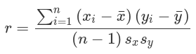

# Exploratory Data Analysis

## Misc Notes

- the foundations for data science are formed by John W. Tukey
- simple plots along with summary statistics

## Elements of structured data

- much of data is unstructured
- two basic types of structured data
	- numeric
	- categorical
- ordinal data (1, 2, 3, 4, 5) ordered categories

## Rectangular Data

- the "label" is also called the "outcome" or the "target". It's the dependent variable

### Data frames and indexes
- in R, the basic rectangular data structure is a `data.frame` object
- `data.table` and `dplyr` for multilevel index in R

**Terminology Differences**
Data scientists: _features_ are used to predict a _target_

Statisticians: _predictor variables_ are used to predict _response_ or _dependent variable_

_Sample_: Computer scientists use _sample_ to mean a single row, stats people use it for a collection of rows

### Nonrectangular Data Structures
Examples of non-rectangular data structures:
- time series data
- spatial data
- graph (network) data structures
  - used to represent physical, social and abstract relationships
  - example: a social network, distribution hubs
  - useful for recommendations systems and network optimization
- rectangular data is the fundamental building block of predictive modeling

**KEY IDEAS**
- The basic structure in DS is the rectangular matrix
- Terminology can be different between disciplines

## Estimates of Location
A "typical value" for each feature is an estimate of where most of the data is located (central tendency)

**Key Terms**
Mean - the average
Weighted Mean - the sum of all values times a weight divided by the sum of the weights
Median - the 50th percentile
Percentile - The value such the _P_ percent of the data lies below AKA quantile
Weighted median - the value such that one-half of the sum of the weights lies above and below the sorted data
Trimmed mean - the average of all values after dropping a fixed number of extreme values
Robust - not sensitive to extreme values
Outlier - a data value that is very different from most of the data

_"statisticians estimate, data scientists measure"_

### Mean


Trimmed mean cuts off _p_ values from both sides of all values, sorted. Helps to
control extreme values


Weighted mean is the sum of weights times values divided by sum of weights. This
helps when particular variables are over or underrepresented.


### Median and Robust Estimates
- The median is less sensitve to the data than the mean.
- When there are an even number of data values, the median is the average of
  the two values that divide the data set into upper and lower halves.

Why use the median?
- remember "Bill Gates walks into a bar, the average person is now a millionaire"
- this type of thing doesn't affect the median

Note: _You can also compute a weighted median_ (look this up)
### Outliers
- always make an effort to investigate outliers
- sometimes an outlier will be the result of erroneous data
- the mean is more sensitive to erroneous data, whereas the median is not
  affected nearly as much

**Anomaly Detection**
In anomaly detection, outliers _are_ the points of interest, the rest of the data
just informs what is normal

The **trimmed mean** is a nice compromise to consider when outliers are present.
it's robust enough to escape major influence from outliers, but also uses
more of the data

There are other **more robust metrics** that can be efficient but if the data
is large enough, it may not make that much of a difference

### Example: Location Estimates of Population and Murder Rates
**Computing mean in R**
```R
> state <- read.csv('state.csv')
> mean(state[['Population']])
[1] 6162876
> mean(state[['Population']], trim=0.1)
[1] 4783697
> median(state[['Population']])
[1] 4436370
```

**Pandas**
```python
state = pd.read_csv('state.csv')
state['Population'].mean()
trim_mean(state['Population'], 0.1)
state['Population'].median()
```

**Weighted mean in R**
This uses the `matrixStats` package
```R
> weighted.mean(state[['Murder.Rate']], w=state[['Population']])
[1] 4.445834
> library('matrixStats')
> weightedMedian(state[['Murder.Rate']], w=state[['Population']])
[1] 4.4
```

**Weighted mean with pandas and numpy**
```python
np.average(state['Murder.Rate'], weights=state['Population'])
wquantiles.median(state['Murder.Rate'], weights=state['Population'])
```
**KEY IDEAS**
- the basic metric for location is the mean but it can be sensitive to outliers
- other metrics like trimmed mean and median are more robust

## Estimates of Variability
- **variability** is at the heart of statistics
- **dispersion** is how tightly clustered or spread apart the data is

**KEY TERMS**
- Deviations - the difference between the observed values and the estimate of
- location
- Variance - The sum of squared deviations from the mean divided by n – 1 where n is the number of data values (AKA mean squared error)
- Standard deviation - the square root of the variance
- Mean absolute deviation - The mean of the absolute values of the deviations from the mean (AKA l1 norm, Manhattan norm)
- Range - the difference between the largest and smallest value in the datset
- Order statistics - metrics based on the sorted data values (AKA ranks)
- Percentile - The value such that P percent of the values take on this value or less and (100–P) percent take on this value or more (AKA quantile)
- Interquantile range - The difference between the 75th percentile and the 25th percentile (AKA IQR)

### Standard Deviation and Related Estimates

- a deviation is a difference between the estimate of location and the observed
data
- the deviations tell us how dispersed the data is around the central value

**Mean absolute deviation**

this is the average of the absolute values of the deviations
(x is the sample mean)

Mean Abs Dev = 

**Variance and Standard deviation**

variance = 

standard deviation = 

For statistical analysis, it's easier to work squared values than absolute
>**Degrees of freedom and N or N-1?
For most problems, data scientists don't really need to worry about DOF.
Using n-1 is based on the premise that you want to makes estimates about
a population based on a sample. If you just use N, you'll underestimate the
true value of the variance and the standard dev in the population. This is
known as a _biased_ estimate. (is this a good explanation? probably worth
doing more research if necessary)

**Not robust to outliers and such**: variance, std dev, mean absolute deviation

a more robust estimate of variability:
**Median absolute devation**
MAD = 

**NOTE from the book**: The variance, the standard deviation, the mean absolute deviation, and the median absolute deviation from the median are not equivalent estimates, even in the case where the data comes from a normal distribution. In fact, the standard deviation is always greater than the mean absolute deviation, which itself is greater than the median absolute deviation. Sometimes, the median absolute deviation is multiplied by a constant scaling factor to put the MAD on the same scale as the standard deviation in the case of a normal distribution. The commonly used factor of 1.4826 means that 50% of the normal distribution fall within the range ±MAD

### Estimates based on Percentiles
- to find percentiles you need to sort the data
- median is the same as 50th percentile
- .8 quantile is the same as the 80th percentile

To find the kth percentile, multiply n by k (decimal). If the number is whole,
the kth percentile will be the average of that number and the number above it,
else, the kth percentile is the product from the previous calculation rounded
up to the nearest whole

**IQR** or interquantile range is the 75th - 25th percentiles


### Example: Variability Estimates of State Population

**Std Dev, IQR and mad in R**
In R, MAD is adjusted to be on the same scale as mean
```R
> sd(state[['Population']])
[1] 6848235
> IQR(state[['Population']])
[1] 4847308
> mad(state[['Population']])
[1] 3849870
```
**pandas**
```python
state['Population'].std()
state['Population'].quantile(0.75) - state['Population'].quantile(0.25)
robust.scale.mad(state['Population']) # for robust MAD use statsmodels pkg
```

**Key Ideas**
- Variance and standard deviation are the most widespread and routinely reported statistics of variability.
- Both are sensitive to outliers.
- More robust metrics include mean absolute deviation, median absolute deviation from the median, and percentiles (quantiles).


## Exploring the Data Distribution
**Key Terms**
- Box plot - A plot introduced by Tukey as a quick way to visualize the distribution of data.
- Frequency table - A tally of the count of numeric data values that fall into a set of intervals (bins).
- Histogram - Not a bar chart, plot of frequency table
- Density plot - smoothed version of histogram, often based on kernel density
estimate

### Percentiles and Boxplots
- percentiles are valuable for summarizing the tails of a distribution

**Display quantiles**
```R
quantile(state[['Murder.Rate']], p=c(.05, .25, .5, .75, .95))
   5%   25%   50%   75%   95%
1.600 2.425 4.000 5.550 6.510
```

and python
```python
state['Murder.Rate'].quantile([0.05, 0.25, 0.5, 0.75, 0.95])
```
**boxplots**
```R
boxplot(state[['Population']]/1000000, ylab='Population (millions)')
```

and python
```python
ax = (state['Population']/1_000_000).plot.box()
ax.set_ylabel('Population (millions)')
```

The median is the horizontal line in the box plot.
Typically neither R nor matplotlib go more than 1.5x the interquantile range
(75th p - 25th p)

### Frequency Tables and Histograms
In R
```R
breaks <- seq(from=min(state[['Population']]),
                to=max(state[['Population']]), length=11)
pop_freq <- cut(state[['Population']], breaks=breaks,
                right=TRUE, include.lowest=TRUE)
table(pop_freq)
```

and python
```python
# using pd.cut
binnedPopulation = pd.cut(state['Population'], 10)
binnedPopulation.value_counts()
```
Do more research on frequency tables, the explanation in the book is somewhat
tedious

**Histograms**
```R
hist(state[['Population']], breaks=breaks)
```

and python
```python
ax = (state['Population'] / 1_000_000).plot.hist(figsize=(4, 4))
ax.set_xlabel('Population (millions)')
```

**Statistical Moments**
Location and variability are the first and second _moments_ of a distribution. Third and fourth moments are _skewness_ and _kurtosis_. Kurtosis is the propensity of the data to have
extreme values. Skewness: skewed to larger or smaller values

### Density Plots and Estimates
- shows the distribution of data as a continuous line

In R
```R
hist(state[['Murder.Rate']], freq=FALSE)
lines(density(state[['Murder.Rate']]), lwd=3, col='blue')
```

and python
```python
ax = state['Murder.Rate'].plot.hist(density=True, xlim=[0,12], bins=range(1,12))
state['Murder.Rate'].plot.density(ax=ax) 1
ax.set_xlabel('Murder Rate (per 100,000)')
```
Note: `ax` adds to the same graph

Density plot displays the histogram as a proportion rather than
frequencies (y-axis). Total area under the density curve == 1. Insead of counts in bins, calculate area under curve between any two points on x-axis

**Density estimation**
For most data science problems you won't need to use the many
available function for density estimation, the base functions
will usually suffice, just know that there are many

**KEY IDEAS from book**
- A frequency table is a tabular version of the frequency counts found in a histogram
- A boxplot—with the top and bottom of the box at the 75th and 25th percentiles, respectively—also gives a quick sense of the distribution of the data; it is often used in side-by-side displays to compare distributions
- A density plot is a smoothed version of a histogram; it requires a function to estimate a plot based on the data (multiple estimates are possible, of course).

## Exploring Binary and Categorical Data

**Key Terms**
- Mode - the most commonly occurring category or value in a data set
- Expected Value - When the categories can be associated with a numeric value, this gives an average value 
based on a category's probability of occurrence

**Bar Charts**
```R
barplot(as.matrix(dfw) / 6, cex.axis=0.8, cex.names=0.7,
        xlab='Cause of delay', ylab='Count')
```

in python
```python
ax = dfw.transpose().plot.bar(figsize=(4, 4), legend=False)
ax.set_xlabel('Cause of delay')
ax.set_ylabel('Count')
```

Bar chart: x-axis usually represents different categories of a factor variable

**Numerical Data as categorical data**
- converting numerical data to categorical data is widely used in analysis
- can help you discover relpationships between features

### Mode
The value that appears most often; generally not used for numeric data
### Expected Value
Expected value is a form a weighted mean where the weights are probabilities

Calculation:
1. Multiply each outcome by its probablility of occurrence
2. Sum the values

Cloud Service example:
- 2 services, $50/month and $300/month
- projected 5% will sign up for 300, 15% for 50, 80% no sign up

EV = (0.05)(300) + (0.15)(50) + (0.80)(0) = 22.5

The expected value of each attendee is $22.50

- often based on a subjective judgement
- examples: EV of 5yrs of profits from a new acquisition, expected cost savings form new patient management software

### Probability
- odds can be converted to probabilities (they aren't exactly the same thing)
- if odds are 2 to 1, prb = 2/(2+1) = 2/3
- in practical terms probability of an event is the proportion of times it will occur 
if the situation could be repeated over and over (frequentist)
- usually an imaginary construction

**KEY IDEAS**
- categorical data is typically summed up in proportions and can be visualized in a bar chart
- categories can be numeric data that has been binned
- expected value is the sum of values times their probability of occurrence, often used to sum up factor variables


## Correlation
When high values of X go with low values of Y, the variables are negatively correlated

**Key Terms**
- Correlation coefficient: measures the extent to which numeric variables are associated with one another (ranges from -1 to +1)
- Correlation matrix: A table where variables are shown on both rows and columns. The cells are the correlation between the variables

The **correlation coefficient** is a more standardized variant of the vector sum of products. Gives an estimate of the correlation that 
always lies on the same scale.

**Pearson's Correlation Coefficient**


CC may not be a useful metric if variables have an association that isn't linear

**Correlation Plots**
In R using `corrplot`
```R
etfs <- sp500_px[row.names(sp500_px) > '2012-07-01',
                 sp500_sym[sp500_sym$sector == 'etf', 'symbol']]
library(corrplot)
corrplot(cor(etfs), method='ellipse')
```

in python using `seaborn.heatmap`:
```python
etfs = sp500_px.loc[sp500_px.index > '2012-07-01',
                    sp500_sym[sp500_sym['sector'] == 'etf']['symbol']]
sns.heatmap(etfs.corr(), vmin=-1, vmax=1,
            cmap=sns.diverging_palette(20, 220, as_cmap=True))
```

- CC is sensitive to outliers
- use R package `robust` with function `covRob` for robust CC computation
- in python, `sklearn.covariance` provides this functionality as well
- There are CC's other than Pearson's, but data scientists can usually stick to this and robust alternatives

### Scatterplots
In R:
```R
plot(telecom$T, telecom$VZ, xlab='ATT (T)', ylab='Verizon (VZ)')
```

Python:
```python
ax = telecom.plot.scatter(x='T', y='VZ', figsize=(4, 4), marker='$\u25EF$')
ax.set_xlabel('ATT (T)')
ax.set_ylabel('Verizon (VZ)')
ax.axhline(0, color='grey', lw=1)
ax.axvline(0, color='grey', lw=1)
```

**KEY IDEAS**
- The correlation coefficient measures the extent to which two paired variables (e.g., height and weight for individuals) are associated with one another.
- When high values of v1 go with low values of v2, v1 and v2 are negatively associated.
- the correlation coefficient is a standardized metric, always ranges between -1 and +1
- a CC of zero indicates no correlation, but be aware that there can be positive and negative correlations even in random arrangements of data

## Exploring Two or More Variables
- methods that explore two variables are called _bivariate analyis_
- _multivariate analysis_ involves multiple variables

**Key Terms**
- Contingency Table: a tally of counts between two or more categorical variables
- Hexagonal Binning: a plot of two numeric variables with the records binned into hexagons
- Contour Plot: a plot showing the density of two numeric variables like a topographical map
- Violin Plot: similar to a boxplot but showing the density estimate 

### Hexagonal Binning and Countours (Plotting Numeric Versus Numeric Data)
- for a dataset with hundreds of thousands to millions of rows, a scatterplot will be too dense
- the book illustrates with the `kc_tax` data set

**Stripping out extremes**
In R:
```R
kc_tax0 <- subset(kc_tax, TaxAssessedValue < 750000 &
                  SqFtTotLiving > 100 &
                  SqFtTotLiving < 3500)
nrow(kc_tax0)
432693
```

Python:
```python
kc_tax0 = kc_tax.loc[(kc_tax.TaxAssessedValue < 750000) &
                     (kc_tax.SqFtTotLiving > 100) &
                     (kc_tax.SqFtTotLiving < 3500), :]
kc_tax0.shape
(432693, 3)
```

NOTE: Hadley Wickham developed `ggplot2`

**Hexagonal Bin Plot**
In R:
```R
ggplot(kc_tax0, (aes(x=SqFtTotLiving, y=TaxAssessedValue))) +
  stat_binhex(color='white') +
  theme_bw() +
  scale_fill_gradient(low='white', high='black') +
  labs(x='Finished Square Feet', y='Tax-Assessed Value')
```

Python:
```python
ax = kc_tax0.plot.hexbin(x='SqFtTotLiving', y='TaxAssessedValue',
                         gridsize=30, sharex=False, figsize=(5, 4))
ax.set_xlabel('Finished Square Feet')
ax.set_ylabel('Tax-Assessed Value')
```

**Contour Plot**
In R using `geom_density2d`:
```R
ggplot(kc_tax0, aes(SqFtTotLiving, TaxAssessedValue)) +
  theme_bw() +
  geom_point(alpha=0.1) +
  geom_density2d(color='white') +
  labs(x='Finished Square Feet', y='Tax-Assessed Value')
```

Python using `seaborn`:
```python
ax = sns.kdeplot(kc_tax0.SqFtTotLiving, kc_tax0.TaxAssessedValue, ax=ax)
ax.set_xlabel('Finished Square Feet')
ax.set_ylabel('Tax-Assessed Value')
```


### Two Categorical Variables
A _contingency table_ is a way to summarize counts by category

In R:
```R
library(descr)
x_tab <- CrossTable(lc_loans$grade, lc_loans$status,
                    prop.c=FALSE, prop.chisq=FALSE, prop.t=FALSE)
```

Python:
```python
crosstab = lc_loans.pivot_table(index='grade', columns='status',
                                aggfunc=lambda x: len(x), margins=True) # margins keywords adds column and row sums

df = crosstab.loc['A':'G',:].copy() # copy the pivot table and ignore sums
df.loc[:,'Charged Off':'Late'] = df.loc[:,'Charged Off':'Late'].div(df['All'],
                                                                    axis=0) # divide rows with the row sum
df['All'] = df['All'] / sum(df['All']) # divide the 'All' column by sum
perc_crosstab = df
```

### Categorical and Numeric Data
A box plot can be used to compare the distributions of numeric variables grouped by categorical variables 

In R:
```R
boxplot(pct_carrier_delay ~ airline, data=airline_stats, ylim=c(0, 50))
```

Python: 
```python
ax = airline_stats.boxplot(by='airline', column='pct_carrier_delay')
ax.set_xlabel('')
ax.set_ylabel('Daily % of Delayed Flights')
plt.suptitle('')
```

**Violin Plots**
Violin plots show the density estimate on the y axis, although this shows more nuance in the distribution
than a boxplot, the latter displays outliers clearly

In R using `geom_violin`:
```R
ggplot(data=airline_stats, aes(airline, pct_carrier_delay)) +
  ylim(0, 50) +
  geom_violin() +
  labs(x='', y='Daily % of Delayed Flights')
```

Python using `seaborn` and the `violinplot` method:
```python
ax = sns.violinplot(airline_stats.airline, airline_stats.pct_carrier_delay,
                    inner='quartile', color='white')
ax.set_xlabel('')
ax.set_ylabel('Daily % of Delayed Flights')
```

### Visualizing Mutiple Variables
Charts for bivariate analysis can be extended to multivariate analysis via the use of _conditions_

In R using `ggplot2` and the idea of _facets_:
```R
ggplot(subset(kc_tax0, ZipCode %in% c(98188, 98105, 98108, 98126)),
         aes(x=SqFtTotLiving, y=TaxAssessedValue)) +
  stat_binhex(color='white') +
  theme_bw() +
  scale_fill_gradient(low='white', high='blue') +
  labs(x='Finished Square Feet', y='Tax-Assessed Value') +
  facet_wrap('ZipCode') 
```

In Python using `seaborn`:
```python
zip_codes = [98188, 98105, 98108, 98126]
kc_tax_zip = kc_tax0.loc[kc_tax0.ZipCode.isin(zip_codes),:]
kc_tax_zip

def hexbin(x, y, color, **kwargs):
    cmap = sns.light_palette(color, as_cmap=True)
    plt.hexbin(x, y, gridsize=25, cmap=cmap, **kwargs)

g = sns.FacetGrid(kc_tax_zip, col='ZipCode', col_wrap=2) 1
g.map(hexbin, 'SqFtTotLiving', 'TaxAssessedValue',
      extent=[0, 3500, 0, 700000]) 2
g.set_axis_labels('Finished Square Feet', 'Tax-Assessed Value')
g.set_titles('Zip code {col_name:.0f}')
```

## Summary
