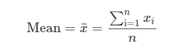
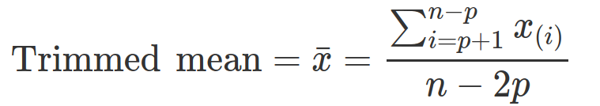
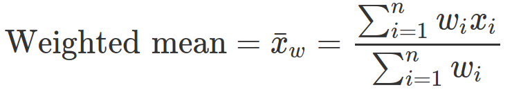
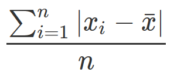
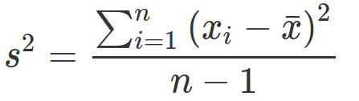
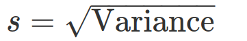
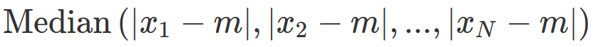

# Exploratory Data Analysis

## Misc Notes

- the foundations for data science are formed by John W. Tukey
- simple plots along with summary statistics

## Elements of structured data

- much of data is unstructured
- two basic types of structured data
	- numeric
	- categorical
- ordinal data (1, 2, 3, 4, 5) ordered categories

## Rectangular Data

- the "label" is also called the "outcome" or the "target". It's the dependent variable

### Data frames and indexes
- in R, the basic rectangular data structure is a `data.frame` object
- `data.table` and `dplyr` for multilevel index in R

**Terminology Differences**
Data scientists: _features_ are used to predict a _target_

Statisticians: _predictor variables_ are used to predict _response_ or _dependent variable_

_Sample_: Computer scientists use _sample_ to mean a single row, stats people use it for a collection of rows

### Nonrectangular Data Structures
Examples of non-rectangular data structures:
- time series data
- spatial data
- graph (network) data structures
  - used to represent physical, social and abstract relationships
  - example: a social network, distribution hubs
  - useful for recommendations systems and network optimization
- rectangular data is the fundamental building block of predictive modeling

**KEY IDEAS**
- The basic structure in DS is the rectangular matrix
- Terminology can be different between disciplines

## Estimates of Location
A "typical value" for each feature is an estimate of where most of the data is located (central tendency)

**Key Terms**
Mean - the average
Weighted Mean - the sum of all values times a weight divided by the sum of the weights
Median - the 50th percentile
Percentile - The value such the _P_ percent of the data lies below AKA quantile
Weighted median - the value such that one-half of the sum of the weights lies above and below the sorted data
Trimmed mean - the average of all values after dropping a fixed number of extreme values
Robust - not sensitive to extreme values
Outlier - a data value that is very different from most of the data

_"statisticians estimate, data scientists measure"_

### Mean


Trimmed mean cuts off _p_ values from both sides of all values, sorted. Helps to
control extreme values


Weighted mean is the sum of weights times values divided by sum of weights. This
helps when particular variables are over or underrepresented.


### Median and Robust Estimates
- The median is less sensitve to the data than the mean.
- When there are an even number of data values, the median is the average of
  the two values that divide the data set into upper and lower halves.

Why use the median?
- remember "Bill Gates walks into a bar, the average person is now a millionaire"
- this type of thing doesn't affect the median

Note: _You can also compute a weighted median_ (look this up)
### Outliers
- always make an effort to investigate outliers
- sometimes an outlier will be the result of erroneous data
- the mean is more sensitive to erroneous data, whereas the median is not
  affected nearly as much

**Anomaly Detection**
In anomaly detection, outliers _are_ the points of interest, the rest of the data
just informs what is normal

The **trimmed mean** is a nice compromise to consider when outliers are present.
it's robust enough to escape major influence from outliers, but also uses
more of the data

There are other **more robust metrics** that can be efficient but if the data
is large enough, it may not make that much of a difference

### Example: Location Estimates of Population and Murder Rates
**Computing mean in R**
```R
> state <- read.csv('state.csv')
> mean(state[['Population']])
[1] 6162876
> mean(state[['Population']], trim=0.1)
[1] 4783697
> median(state[['Population']])
[1] 4436370
```

**Pandas**
```python
state = pd.read_csv('state.csv')
state['Population'].mean()
trim_mean(state['Population'], 0.1)
state['Population'].median()
```

**Weighted mean in R**
This uses the `matrixStats` package
```R
> weighted.mean(state[['Murder.Rate']], w=state[['Population']])
[1] 4.445834
> library('matrixStats')
> weightedMedian(state[['Murder.Rate']], w=state[['Population']])
[1] 4.4
```

**Weighted mean with pandas and numpy**
```python
np.average(state['Murder.Rate'], weights=state['Population'])
wquantiles.median(state['Murder.Rate'], weights=state['Population'])
```
**KEY IDEAS**
- the basic metric for location is the mean but it can be sensitive to outliers
- other metrics like trimmed mean and median are more robust

## Estimates of Variability
- **variability** is at the heart of statistics
- **dispersion** is how tightly clustered or spread apart the data is

**KEY TERMS**
- Deviations - the difference between the observed values and the estimate of
- location
- Variance - The sum of squared deviations from the mean divided by n – 1 where n is the number of data values (AKA mean squared error)
- Standard deviation - the square root of the variance
- Mean absolute deviation - The mean of the absolute values of the deviations from the mean (AKA l1 norm, Manhattan norm)
- Range - the difference between the largest and smallest value in the datset
- Order statistics - metrics based on the sorted data values (AKA ranks)
- Percentile - The value such that P percent of the values take on this value or less and (100–P) percent take on this value or more (AKA quantile)
- Interquantile range - The difference between the 75th percentile and the 25th percentile (AKA IQR)

### Standard Deviation and Related Estimates

- a deviation is a difference between the estimate of location and the observed
data
- the deviations tell us how dispersed the data is around the central value

**Mean absolute deviation**

this is the average of the absolute values of the deviations
(x is the sample mean)

Mean Abs Dev = 

**Variance and Standard deviation**

variance = 

standard deviation = 

For statistical analysis, it's easier to work squared values than absolute
>**Degrees of freedom and N or N-1?
For most problems, data scientists don't really need to worry about DOF.
Using n-1 is based on the premise that you want to makes estimates about
a population based on a sample. If you just use N, you'll underestimate the
true value of the variance and the standard dev in the population. This is
known as a _biased_ estimate. (is this a good explanation? probably worth
doing more research if necessary)

**Not robust to outliers and such**: variance, std dev, mean absolute deviation

a more robust estimate of variability:
**Median absolute devation**
MAD = 

**NOTE from the book**: The variance, the standard deviation, the mean absolute deviation, and the median absolute deviation from the median are not equivalent estimates, even in the case where the data comes from a normal distribution. In fact, the standard deviation is always greater than the mean absolute deviation, which itself is greater than the median absolute deviation. Sometimes, the median absolute deviation is multiplied by a constant scaling factor to put the MAD on the same scale as the standard deviation in the case of a normal distribution. The commonly used factor of 1.4826 means that 50% of the normal distribution fall within the range ±MAD

### Estimates based on Percentiles
- to find percentiles you need to sort the data
- median is the same as 50th percentile
- .8 quantile is the same as the 80th percentile

To find the kth percentile, multiply n by k (decimal). If the number is whole,
the kth percentile will be the average of that number and the number above it,
else, the kth percentile is the product from the previous calculation rounded
up to the nearest whole

**IQR** or interquantile range is the 75th - 25th percentiles


### Example: Variability Estimates of State Population

**Std Dev, IQR and mad in R**
In R, MAD is adjusted to be on the same scale as mean
```R
> sd(state[['Population']])
[1] 6848235
> IQR(state[['Population']])
[1] 4847308
> mad(state[['Population']])
[1] 3849870
```
**pandas**
```python
state['Population'].std()
state['Population'].quantile(0.75) - state['Population'].quantile(0.25)
robust.scale.mad(state['Population']) # for robust MAD use statsmodels pkg
```

**Key Ideas**
- Variance and standard deviation are the most widespread and routinely reported statistics of variability.
- Both are sensitive to outliers.
- More robust metrics include mean absolute deviation, median absolute deviation from the median, and percentiles (quantiles).


## Exploring the Data Distribution
**Key Terms**
- Box plot - A plot introduced by Tukey as a quick way to visualize the distribution of data.
- Frequency table - A tally of the count of numeric data values that fall into a set of intervals (bins).
- Histogram - Not a bar chart, plot of frequency table
- Density plot - smoothed version of histogram, often based on kernel density
estimate

### Percentiles and Boxplots
- percentiles are valuable for summarizing the tails of a distribution

**Display quantiles**
```R
quantile(state[['Murder.Rate']], p=c(.05, .25, .5, .75, .95))
   5%   25%   50%   75%   95%
1.600 2.425 4.000 5.550 6.510
```

and python
```python
state['Murder.Rate'].quantile([0.05, 0.25, 0.5, 0.75, 0.95])
```
**boxplots**
```R
boxplot(state[['Population']]/1000000, ylab='Population (millions)')
```

and python
```python
ax = (state['Population']/1_000_000).plot.box()
ax.set_ylabel('Population (millions)')
```

The median is the horizontal line in the box plot.
Typically neither R nor matplotlib go more than 1.5x the interquantile range
(75th p - 25th p)

### Frequency Tables and Histograms
In R
```R
breaks <- seq(from=min(state[['Population']]),
                to=max(state[['Population']]), length=11)
pop_freq <- cut(state[['Population']], breaks=breaks,
                right=TRUE, include.lowest=TRUE)
table(pop_freq)
```

and python
```python
# using pd.cut
binnedPopulation = pd.cut(state['Population'], 10)
binnedPopulation.value_counts()
```
Do more research on frequency tables, the explanation in the book is somewhat
tedious

**Histograms**
```R
hist(state[['Population']], breaks=breaks)
```

and python
```python
ax = (state['Population'] / 1_000_000).plot.hist(figsize=(4, 4))
ax.set_xlabel('Population (millions)')
```
 

### Density Plots and Estimates

## Exploring Binary and Categorical Data

### Mode
### Expected Value
### Probability

## Correlation

### Scatterplots

## Exploring Two or More Variables

### Hexagonal Binning and Countours (Plotting Numeric Versus Numeric Data)
### Two Categorical Variables
### Categorical and Numeric Data
### Visualizing Mutiple Variables

## Summary
